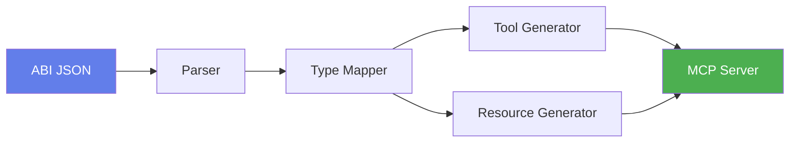

# Core Concepts

This section explains the fundamental concepts you need to understand to work effectively with abi-to-mcp.

## Overview

abi-to-mcp bridges the gap between smart contracts and AI assistants. To do this effectively, it must handle several key challenges:

1. **Type Translation** - Converting Solidity types to JSON Schema and Python
2. **Operation Classification** - Distinguishing read vs write operations
3. **Event Handling** - Exposing historical data through resources
4. **Safety** - Preventing accidental or unauthorized transactions

## Key Concepts

<div class="grid cards" markdown>

-   :material-swap-horizontal:{ .lg .middle } __Type Mapping__

    ---

    How Solidity types are converted to JSON Schema for validation and Python for code generation.

    [:octicons-arrow-right-24: Type Mapping](type-mapping.md)

-   :material-tools:{ .lg .middle } __Tool Types__

    ---

    The difference between read, write, and payable tools and how they're handled.

    [:octicons-arrow-right-24: Tool Types](tool-types.md)

-   :material-calendar:{ .lg .middle } __Events & Resources__

    ---

    How contract events become queryable MCP resources.

    [:octicons-arrow-right-24: Events](events.md)

-   :material-shield-check:{ .lg .middle } __Safety Features__

    ---

    Built-in protections for safe smart contract interaction.

    [:octicons-arrow-right-24: Safety](safety.md)

-   :material-shield-search:{ .lg .middle } __Security Scanner__

    ---

    Detect rug pulls, honeypots, and 50+ risks before connecting your AI agent.

    [:octicons-arrow-right-24: Security Scanner](security-scanner.md)

</div>

## The MCP Protocol

The Model Context Protocol (MCP) defines how AI assistants connect to external tools. Key concepts:

### Tools

Tools are functions the AI can call. In abi-to-mcp, each contract function becomes a tool:

```
Solidity Function → MCP Tool → AI Capability
```

For example:
```
balanceOf(address) → balance_of tool → "Check token balance"
```

### Resources

Resources are data sources the AI can query. In abi-to-mcp, events become resources:

```
Solidity Event → MCP Resource → Historical Data
```

For example:
```
Transfer event → events://transfer → "Recent transfers"
```

### Schemas

Both tools and resources have JSON Schemas that define their parameters and return types. This allows:

- **Validation** - Ensure inputs are correct before calling
- **Documentation** - AI understands what parameters mean
- **Type Safety** - Catch errors early

## The Generation Pipeline



1. **Parser** - Reads ABI JSON and creates structured objects
2. **Type Mapper** - Converts Solidity types to JSON Schema
3. **Tool Generator** - Creates MCP tool definitions
4. **Resource Generator** - Creates MCP resource definitions
5. **MCP Server** - Complete runnable server

## Understanding ABIs

An ABI (Application Binary Interface) is a JSON description of a smart contract's interface:

```json
[
  {
    "type": "function",
    "name": "balanceOf",
    "inputs": [{"name": "account", "type": "address"}],
    "outputs": [{"name": "", "type": "uint256"}],
    "stateMutability": "view"
  },
  {
    "type": "event",
    "name": "Transfer",
    "inputs": [
      {"name": "from", "type": "address", "indexed": true},
      {"name": "to", "type": "address", "indexed": true},
      {"name": "value", "type": "uint256", "indexed": false}
    ]
  }
]
```

abi-to-mcp reads this and generates corresponding MCP tools and resources.

## Next Steps

Start with [Type Mapping](type-mapping.md) to understand how types are converted.
