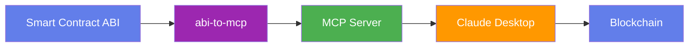

# UCAI

**The ABI-to-MCP Server Generator.** Generate AI-ready interfaces for any smart contract in seconds.

UCAI converts Ethereum smart contract ABIs into [Model Context Protocol (MCP)](https://modelcontextprotocol.io) servers, enabling AI assistants like Claude to interact with DeFi protocols, NFTs, tokens, and any on-chain contract.

<div class="grid cards" markdown>

-   :material-clock-fast:{ .lg .middle } __Zero to MCP in 30 Seconds__

    ---

    One command generates a complete, production-ready server:

    ```bash
    abi-to-mcp generate 0xA0b86991c6218b36c1d19D4a2e9Eb0cE3606eB48 -n mainnet
    ```

    [:octicons-arrow-right-24: Quickstart](getting-started/quickstart.md)

-   :material-shield-check:{ .lg .middle } __Safety First__

    ---

    Write operations simulate by default. You explicitly opt-in to real transactions.

    [:octicons-arrow-right-24: Safety features](concepts/safety.md)

-   :material-network:{ .lg .middle } __10+ Networks__

    ---

    Ethereum, Polygon, Arbitrum, Optimism, Base, BSC, Avalanche, and more.

    [:octicons-arrow-right-24: Supported networks](reference/networks.md)

-   :material-language-python:{ .lg .middle } __Python API__

    ---

    Programmatic access for custom workflows and integrations.

    [:octicons-arrow-right-24: API reference](api/index.md)

</div>

## 🌐 Try It Online

Don't want to install anything? Use the **[Web Builder](https://mcp.ucai.tech)** to generate MCP servers directly in your browser:

<div class="grid cards" markdown>

-   :material-shield-search:{ .lg .middle } __Security Scanner__

    ---

    Detect rug pulls, honeypots, and 50+ risks before connecting your AI agent.

    [:octicons-arrow-right-24: Learn more](concepts/security-scanner.md)

-   :material-book-open:{ .lg .middle } __Contract Whisperer__

    ---

    Get plain English explanations of what any contract does.

    [:octicons-arrow-right-24: Web Builder guide](guides/web-builder.md)

-   :material-lightning-bolt:{ .lg .middle } __Pro Templates__

    ---

    Pre-built bundles for Flash Loans, Arbitrage, Yield Farming, and more.

    [:octicons-arrow-right-24: Web Builder guide](guides/web-builder.md)

</div>

## What is MCP?

The Model Context Protocol (MCP) is a standard for connecting AI assistants to external tools and data sources. When you generate an MCP server from a smart contract ABI, Claude can:

- **Query** token balances, allowances, and contract state
- **Inspect** NFT metadata and ownership
- **Simulate** transactions before execution
- **Execute** transfers, swaps, and other operations (with your approval)

## Quick Example

Here's what it looks like to use a generated MCP server with Claude:

<div class="result" markdown>

> **You:** What's the USDC balance of vitalik.eth?

> **Claude:** I'll check the USDC balance for vitalik.eth.
> 
> Using `balance_of` tool with address `0xd8dA6BF26964aF9D7eEd9e03E53415D37aA96045`...
> 
> The balance is **2,547.32 USDC**.

</div>

## Installation

=== "pip"

    ```bash
    pip install abi-to-mcp
    ```

=== "pipx"

    ```bash
    pipx install abi-to-mcp
    ```

=== "From source"

    ```bash
    git clone https://github.com/nirholas/UCAI.git
    cd UCAI
    pip install -e .
    ```

## Supported Contract Types

abi-to-mcp works with any EVM smart contract, with special support for common standards:

| Standard | Auto-Detection | Features |
|----------|---------------|----------|
| ERC-20   | ✅ Yes | Token transfers, approvals, balance queries |
| ERC-721  | ✅ Yes | NFT ownership, metadata, safe transfers |
| ERC-1155 | ✅ Yes | Multi-token operations, batch transfers |
| ERC-4626 | ✅ Yes | Vault deposits, withdrawals, share calculations |
| Custom   | ✅ Yes | All functions and events exposed as tools |

## How It Works



1. **Fetch** - Retrieve the ABI from Etherscan, Sourcify, or a local file
2. **Parse** - Analyze functions, events, and types
3. **Map** - Convert Solidity types to JSON Schema and Python types
4. **Generate** - Create a complete MCP server with all tools and resources
5. **Run** - Start the server and connect it to Claude Desktop

## Next Steps

<div class="grid cards" markdown>

-   [:octicons-rocket-24: __Getting Started__](getting-started/index.md)

    Install and generate your first MCP server in 5 minutes.

-   [:octicons-terminal-24: __CLI Reference__](cli/index.md)

    Complete documentation for all commands.

-   [:octicons-book-24: __Guides__](guides/index.md)

    Step-by-step tutorials for common use cases.

-   [:octicons-code-24: __Python API__](api/index.md)

    Integrate UCAI into your own applications.

</div>

## Community

- **GitHub Issues**: [Report bugs or request features](https://github.com/nirholas/UCAI/issues)
- **Discussions**: [Ask questions and share ideas](https://github.com/nirholas/UCAI/discussions)
- **Contributing**: [Help improve UCAI](contributing/index.md)
